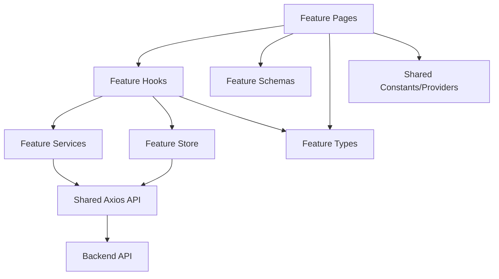
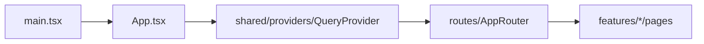
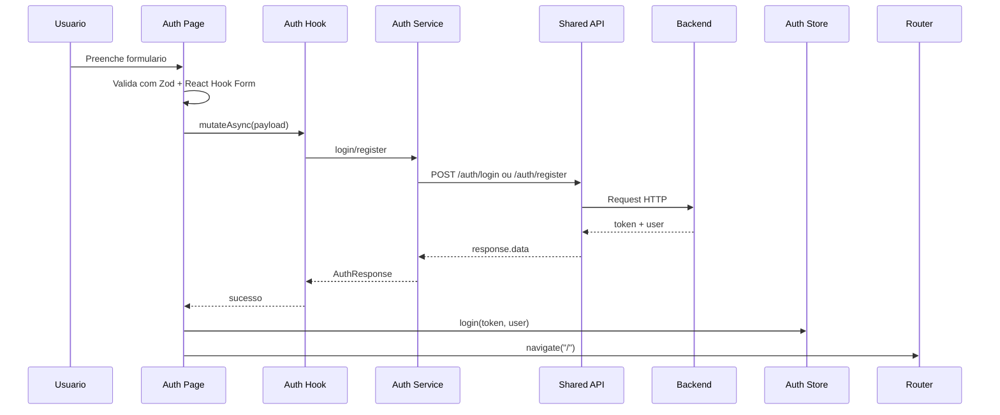
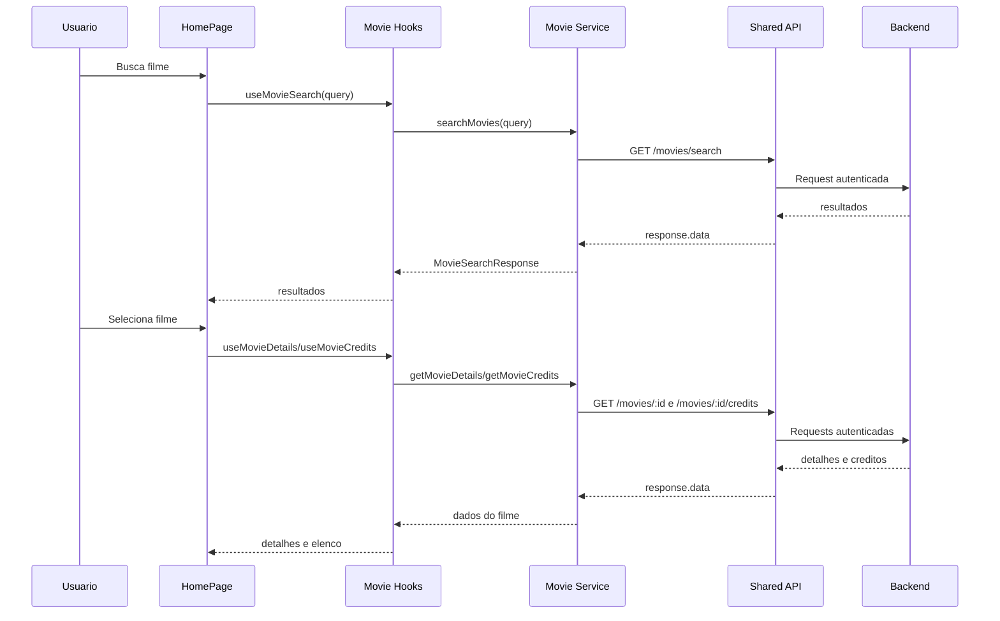

# Frontend Architecture

## Objetivo

Este documento descreve a arquitetura feature-based do frontend, os fluxos principais e as convencoes para evoluir a aplicacao sem voltar para pastas globais por camada.

## Visao Arquitetural

O frontend separa codigo em dois grupos:

- `features/`: dominios de produto, como `auth` e `movies`
- `shared/`: infraestrutura e contratos transversais usados por mais de uma feature

Cada feature pode conter suas proprias paginas, hooks, services, schemas, types, constantes, store e helpers. Isso reduz acoplamento entre dominios e facilita encontrar tudo que pertence a um fluxo.

## Estrutura

```text
src/
  features/
    auth/
      constants/
      hooks/
      pages/
      schemas/
      services/
      store/
      types/
    movies/
      hooks/
      pages/
      services/
      types/
      utils/
  routes/
  shared/
    constants/
    providers/
    services/
  App.tsx
  main.tsx
```

## Diagrama De Camadas



Regras praticas:

- paginas nao chamam o backend diretamente
- hooks conectam UI, React Query, services e store
- services usam somente o client HTTP compartilhado
- tipos e schemas ficam na feature quando pertencem a um dominio especifico
- `shared/` deve ser pequeno e realmente transversal

## Fluxos Principais

### Bootstrap



### Autenticacao



### Filmes



## Convencoes

- Use `PascalCase` para componentes e paginas.
- Use `camelCase` para funcoes, hooks e variaveis.
- Hooks devem comecar com `use`.
- Services devem expor funcoes orientadas a caso de uso, como `login`, `register`, `searchMovies`.
- Arquivos compartilhados so devem entrar em `shared/` quando mais de uma feature precisar deles.
- Nao crie aliases de import sem uma decisao explicita de projeto; mantenha imports relativos por enquanto.

## Evolucao

Para adicionar uma feature, crie `src/features/<feature-name>/` e inclua apenas as pastas necessarias. Se uma nova feature precisar de endpoints no backend, primeiro preserve os contratos REST existentes e documente qualquer mudanca de payload ou rota antes de atualizar os consumers do frontend.
