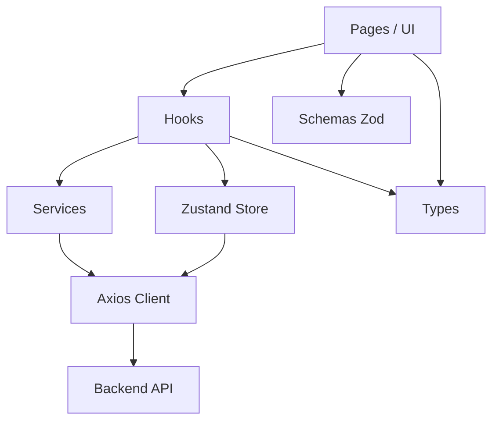
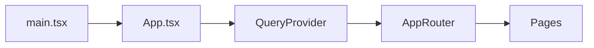
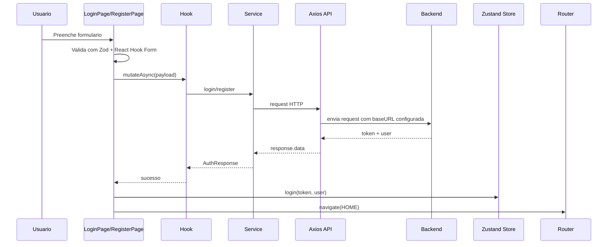
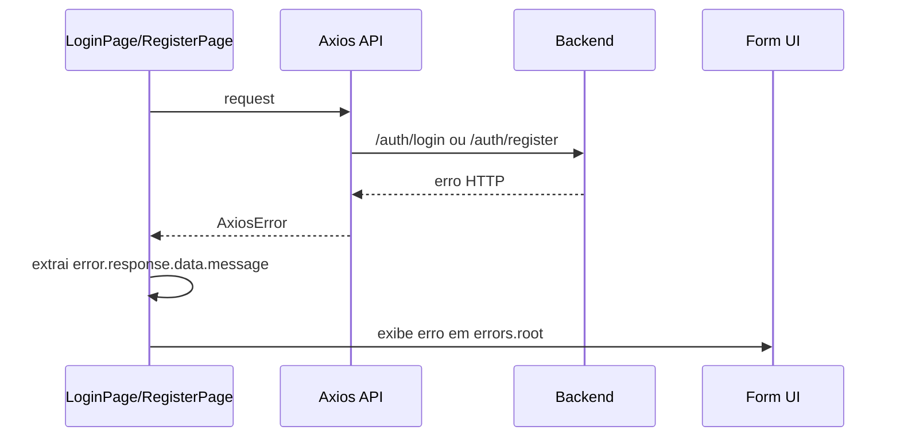
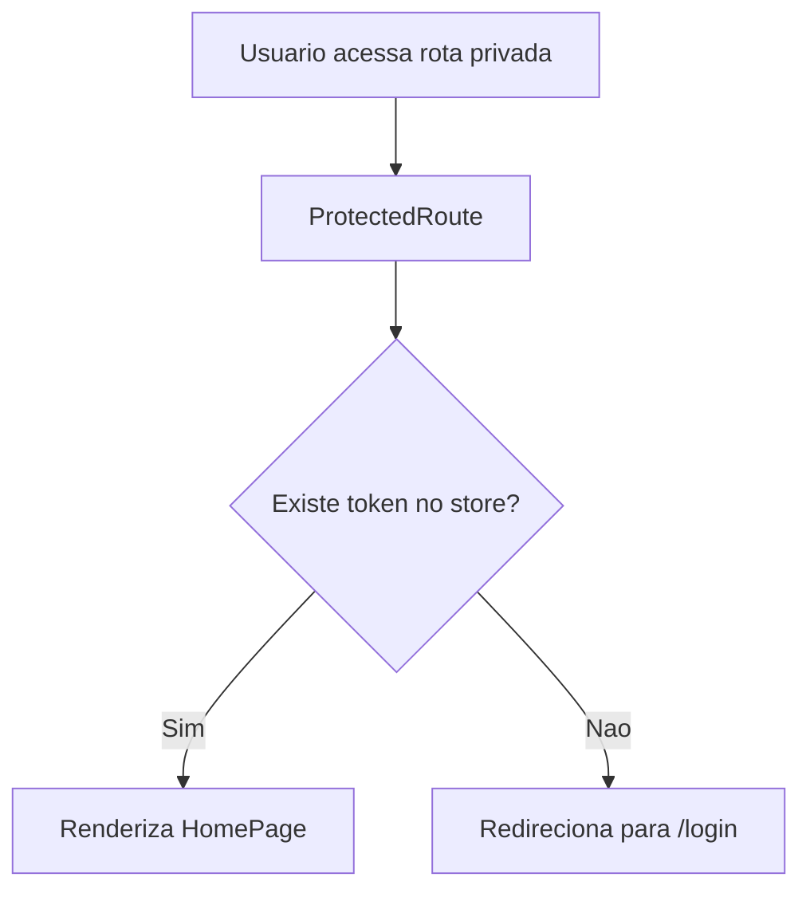
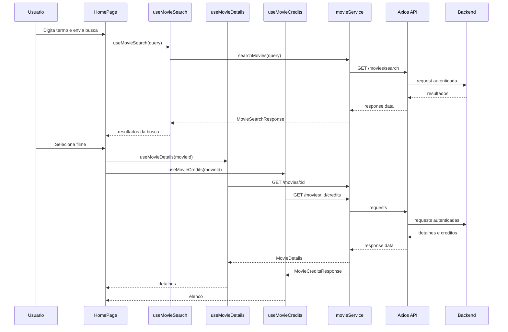

# Frontend Architecture

## Objetivo deste documento

Este documento complementa o `context.md` e foca em três coisas:

- arquitetura de camadas do frontend
- diagramas de fluxo para navegação e consumo de dados
- convenções de naming e organização para futuras features

Ele deve ser usado como referência de implementação antes de criar:

- novas páginas
- novos hooks
- novos services
- novos tipos
- novos fluxos autenticados

---

## Visão arquitetural

O frontend segue uma arquitetura simples, orientada por responsabilidades, com separação entre:

- UI
- estado global
- dados remotos
- validação
- contratos tipados

### Camadas atuais

1. `pages`
   - representam fluxos de tela e composição visual
2. `hooks`
   - conectam a UI aos dados, mutations e estado compartilhado
3. `services`
   - fazem chamadas HTTP ao backend
4. `store`
   - mantém sessão e dados globais persistidos
5. `schemas`
   - validam formulários no client
6. `types`
   - definem contratos do domínio
7. `constants`
   - centralizam strings reutilizáveis e rotas

---

## Diagrama de camadas



### Leitura do diagrama

- a UI nunca deveria chamar o backend diretamente
- a UI pode usar schemas para validação local
- hooks fazem a ponte entre UI, services e store
- services usam `api.ts`
- `api.ts` concentra autenticação por header e reação a `401`

---

## Fluxo de bootstrap



### Regra prática

Se uma feature precisar de provider global, ela deve entrar em `App.tsx` ou em um provider dedicado dentro de `providers/`, não diretamente dentro de uma página.

---

## Fluxo de autenticação



### Fluxo de falha de autenticação



---

## Fluxo de rota protegida



### Regra prática

Se uma nova página depender de autenticação, ela deve ficar dentro do bloco protegido no `AppRouter`.

---

## Fluxo de busca de filmes



---

## Estrutura de pastas recomendada

### Estrutura atual

```text
src/
  assets/
  constants/
  hooks/
  pages/
  providers/
  routes/
  schemas/
  services/
  store/
  types/
  App.tsx
  main.tsx
  index.css
```

### Quando manter a estrutura atual

Use a estrutura atual quando:

- a feature é pequena
- há poucos arquivos por domínio
- o acoplamento ainda é baixo
- a navegação é simples

### Quando considerar estrutura por feature

Se o projeto crescer bastante, considere migrar para algo assim:

```text
src/
  features/
    auth/
      components/
      hooks/
      services/
      types/
      schemas/
    movies/
      components/
      hooks/
      services/
      types/
  shared/
    components/
    constants/
    services/
    types/
```

### Regra prática

Não migre por antecipação. Só vale mudar para estrutura por feature quando a organização atual começar a dificultar navegação, ownership ou reutilização.

---

## Guia de naming

## 1. Pages

Padrão:

- `PascalCase`
- sufixo `Page`

Exemplos:

- `LoginPage.tsx`
- `RegisterPage.tsx`
- `HomePage.tsx`

### Regra

Arquivos em `pages/` devem representar telas de rota, não componentes genéricos.

---

## 2. Hooks

Padrão:

- `camelCase`
- prefixo obrigatório `use`
- nome orientado à intenção

Exemplos:

- `useLogin`
- `useRegister`
- `useMovieSearch`
- `useMovieDetails`
- `useMovieCredits`
- `useAuth`

### Regra

Hooks devem expressar claramente o que fazem:

- `use<Acao>` para mutations
- `use<Recurso>` ou `use<Recurso><Operacao>` para queries

Evitar nomes genéricos como:

- `useData`
- `useApi`
- `useFetch`

---

## 3. Services

Padrão:

- arquivo em `camelCase` com sufixo `.service.ts`
- objeto exportado com nome do domínio

Exemplos:

- `auth.service.ts`
- `movie.service.ts`
- `authService`
- `movieService`

### Regra

Services:

- falam com a API
- não renderizam UI
- não acessam DOM
- não usam hooks React

Devem ser finos e previsíveis.

---

## 4. Types

Padrão:

- interfaces ou types em `PascalCase`
- nomes específicos por domínio

Exemplos:

- `AuthResponse`
- `LoginRequest`
- `MovieSearchResponse`
- `MovieDetails`
- `MovieCastMember`

### Regra

Tipos devem descrever contrato de domínio, não detalhes visuais.

Bom:

- `MovieDetails`
- `RegisterRequest`

Evitar:

- `CardData`
- `FormStuff`

---

## 5. Constants

Padrão:

- objeto exportado em `UPPER_SNAKE_CASE` quando representar conjunto fixo
- arquivo descritivo por domínio

Exemplos:

- `ROUTES`
- `AUTH_MESSAGES`

### Regra

Se uma string ou conjunto de strings for reutilizado em mais de um lugar, extraia para `constants/`.

---

## 6. Store

Padrão:

- `<domain>.store.ts`
- helper opcional `<domain>.helpers.ts`

Exemplos:

- `auth.store.ts`
- `auth.helpers.ts`

### Regra

Helpers de store existem para uso fora de componentes, especialmente em interceptors ou serviços de infraestrutura.

---

## 7. Schemas

Padrão:

- `<domain>.schema.ts`

Exemplos:

- `auth.schema.ts`

### Regra

Schemas devem representar validação de entrada de formulário ou payload local. Não devem conter lógica visual.

---

## 8. Componentes futuros

Se começarmos a extrair componentes compartilhados, o padrão recomendado é:

- `PascalCase.tsx`
- nome baseado em responsabilidade visual

Exemplos:

- `MovieCard.tsx`
- `SearchForm.tsx`
- `AuthFormField.tsx`
- `PageHeader.tsx`

### Regra

Se um componente:

- não representa rota
- é reutilizável
- ou reduz complexidade de uma página

ele não deve ficar em `pages/`; deve ir para `components/` ou para uma pasta local da feature.

---

## Guia de responsabilidade por camada

### `pages/`

Pode:

- compor layout
- orquestrar hooks
- reagir a submit e eventos
- decidir o que renderizar

Não deve:

- fazer request HTTP diretamente
- concentrar transformação complexa de dados se isso puder ser reutilizado

### `hooks/`

Pode:

- encapsular `useQuery` e `useMutation`
- combinar estado local e dados remotos
- centralizar query keys

Não deve:

- renderizar JSX
- depender de DOM

### `services/`

Pode:

- fazer request
- montar params e payloads
- tipar resposta

Não deve:

- manipular estado React
- conter comportamento visual

### `store/`

Pode:

- persistir sessão
- guardar estado compartilhado de autenticação

Não deve:

- substituir React Query para dados remotos

### `types/`

Pode:

- modelar payloads e respostas

Não deve:

- misturar regras de negócio com lógica de render

---

## Padrões para novas features

## Exemplo 1: adicionar favoritos

Arquivos recomendados:

```text
src/
  services/favorite.service.ts
  hooks/useFavorites.ts
  hooks/useAddFavorite.ts
  hooks/useRemoveFavorite.ts
  types/favorite.types.ts
  constants/favoriteMessages.ts
```

Se a UI crescer:

```text
src/components/favorites/
```

---

## Exemplo 2: adicionar paginação de filmes

Mudanças recomendadas:

- estender `MovieSearchResponse`
- adicionar controle de página na `HomePage`
- atualizar `movieService.searchMovies(query, page?)`
- atualizar `useMovieSearch(query, page)`

Regra:

- paginação faz parte do domínio de movies
- portanto deve ficar em `movie.service.ts`, `useMovieSearch.ts` e `movie.types.ts`
- não deve nascer como lógica espalhada só na UI

---

## Exemplo 3: adicionar perfil do usuário

Arquivos recomendados:

```text
src/
  pages/Profile/ProfilePage.tsx
  services/user.service.ts
  hooks/useProfile.ts
  types/user.types.ts
```

Se houver edição:

```text
src/
  schemas/user.schema.ts
  hooks/useUpdateProfile.ts
```

---

## Anti-patterns a evitar

- chamar `axios` direto dentro de página
- duplicar rotas como string hardcoded em múltiplos arquivos
- colocar token manualmente em cada request
- colocar lógica de erro repetida em muitos componentes sem extração
- criar hooks genéricos demais sem domínio claro
- usar Zustand para cachear dados remotos que já pertencem ao React Query
- misturar componente de rota com componente reutilizável no mesmo lugar

---

## Estratégia de evolução recomendada

### Curto prazo

- extrair componentes reutilizáveis de formulário
- padronizar mensagens do schema para PT-BR
- criar constantes de erro para filmes

### Médio prazo

- centralizar query keys
- introduzir `components/` compartilhados
- quebrar a `HomePage` em subcomponentes

### Longo prazo

- avaliar organização por feature
- adicionar testes de integração de páginas
- adicionar observabilidade de erros de UI

---

## Checklist para criar uma nova feature

Antes de implementar, confirme:

1. existe rota nova ou é uma extensão de página existente?
2. precisa de autenticação?
3. precisa de schema?
4. precisa de tipos novos?
5. precisa de service novo?
6. precisa de hook React Query novo?
7. alguma string deve virar constante?
8. a lógica está indo para a camada certa?

---

## Resumo prático

O padrão ideal deste frontend hoje é:

- `Page` compõe
- `hook` orquestra
- `service` consulta API
- `store` guarda sessão
- `schema` valida entrada
- `types` descrevem contrato
- `constants` evitam duplicação

Se uma nova feature seguir essa linha, ela tende a encaixar sem fricção no que já existe.
